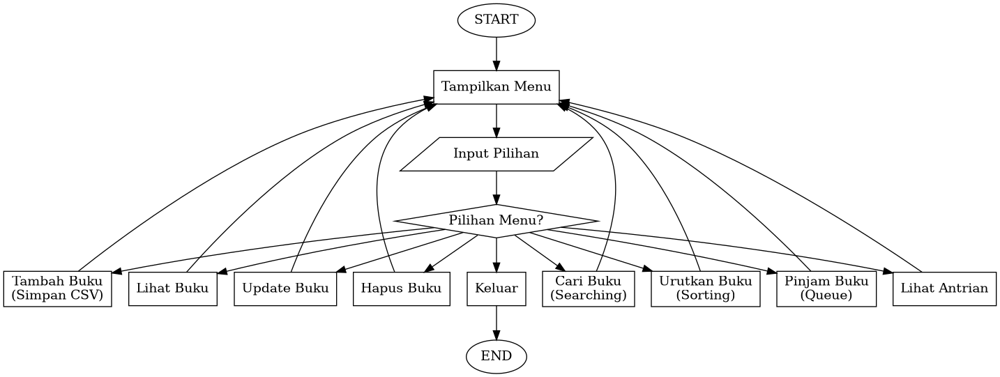

# SISTEM MANAJEMEN PERPUSTAKAAN BERBASIS CSV MENGGUNAKAN PYTHON

## Nama : Risti Alfiah

## NIM : 25416255201023

## Deskripsi Proyek

Sistem Manajemen Perpustakaan merupakan aplikasi berbasis command line yang dikembangkan menggunakan bahasa pemrograman Python dengan penyimpanan data menggunakan file CSV (Comma Separated Values). Aplikasi ini dirancang untuk membantu pengelolaan data buku dan proses peminjaman buku secara sederhana tanpa menggunakan database seperti MySQL atau PostgreSQL.

Aplikasi ini mendukung operasi CRUD (Create, Read, Update, Delete), pencarian data, pengurutan data, serta pengelolaan antrean peminjaman buku. Seluruh data disimpan dalam file CSV sehingga mudah digunakan dan dipindahkan tanpa memerlukan instalasi database tambahan.

## Tujuan Proyek

Tujuan dari proyek ini adalah:

1. Mengimplementasikan operasi CRUD menggunakan Python.
2. Mengelola data menggunakan file CSV sebagai basis data.
3. Mengimplementasikan struktur data dalam penyelesaian permasalahan nyata.
4. Mengimplementasikan algoritma pencarian (searching) dan pengurutan (sorting).
5. Membuat aplikasi manajemen data berbasis command line.

## Fitur Aplikasi

Fitur yang tersedia pada sistem meliputi:

1. Menambah data buku.
2. Menampilkan seluruh data buku.
3. Mengubah data buku.
4. Menghapus data buku.
5. Mencari buku berdasarkan judul.
6. Mengurutkan data buku berdasarkan judul.
7. Melakukan peminjaman buku.
8. Menampilkan antrean peminjaman buku.
9. Menyimpan dan membaca data dari file CSV.

## Struktur Folder

```text
perpustakaan/
│
├── main.py
├── buku.csv
├── peminjaman.csv
│
├── modules/
│   ├── crud.py
│   ├── sorting.py
│   ├── searching.py
│   ├── queue_pinjam.py
│   └── csv_handler.py
│
└── README.md
```

## Struktur Data yang Digunakan

### Dictionary (Hash Map)

Dictionary digunakan untuk menyimpan data buku dalam bentuk pasangan key dan value. Struktur ini memudahkan proses akses, pembaruan, dan penghapusan data.

Contoh:

```python
{
    "id_buku": "B001",
    "judul": "Python Dasar",
    "penulis": "Andi",
    "stok": "5"
}
```

### Queue

Queue digunakan untuk mengelola antrean peminjaman buku dengan prinsip FIFO (First In First Out), yaitu data yang masuk terlebih dahulu akan diproses terlebih dahulu.

Implementasi queue menggunakan modul deque dari library collections.

## Algoritma yang Digunakan

### Searching

Pencarian data menggunakan metode Linear Search. Algoritma ini melakukan pencarian dengan memeriksa setiap data buku hingga ditemukan data yang sesuai dengan kata kunci yang dimasukkan pengguna.

### Sorting

Pengurutan data menggunakan algoritma Bubble Sort. Data buku akan diurutkan berdasarkan judul buku secara alfabetis.

## File Database

### buku.csv

File ini digunakan untuk menyimpan data buku.

Struktur data:

```text
id_buku,judul,penulis,stok
```

Contoh:

```text
B001,Python Dasar,Andi,5
B002,Struktur Data,Budi,3
```

### peminjaman.csv

File ini digunakan untuk menyimpan data peminjaman buku.

Struktur data:

```text
id_pinjam,nama,id_buku
```

Contoh:

```text
P001,Jihan,B001
```

## Cara Menjalankan Program

### Persyaratan

- Python versi 3.x
- Terminal atau Command Prompt

### Langkah Menjalankan

1. Pastikan Python telah terpasang pada komputer.
2. Buka terminal atau Command Prompt.
3. Masuk ke direktori proyek.

```bash
cd perpustakaan
```

4. Jalankan program.

```bash
python main.py
```

atau

```bash
python3 main.py
```

## Menu Program

Saat program dijalankan, pengguna akan melihat menu sebagai berikut:

```text
===== SISTEM PERPUSTAKAAN =====

1. Tambah Buku
2. Lihat Buku
3. Update Buku
4. Hapus Buku
5. Cari Buku
6. Urutkan Buku
7. Pinjam Buku
8. Lihat Antrian
9. Keluar
```

Pengguna dapat memilih menu sesuai kebutuhan dengan memasukkan nomor menu yang tersedia.

## Implementasi CRUD

### Create

Menambahkan data buku baru ke dalam file buku.csv.

### Read

Menampilkan seluruh data buku yang tersimpan.

### Update

Mengubah informasi buku berdasarkan ID buku.

### Delete

Menghapus data buku berdasarkan ID buku.

## Kelebihan Sistem

1. Tidak memerlukan database server.
2. Mudah dijalankan pada berbagai sistem operasi.
3. Struktur program sederhana dan mudah dipahami.
4. Menggunakan struktur data dan algoritma yang sesuai dengan kebutuhan proyek.
5. Cocok digunakan sebagai media pembelajaran Python dan struktur data.

## Kesimpulan

Sistem Manajemen Perpustakaan Berbasis CSV merupakan aplikasi sederhana yang mampu mengelola data buku dan peminjaman dengan memanfaatkan file CSV sebagai media penyimpanan data. Sistem ini telah mengimplementasikan operasi CRUD, struktur data Dictionary dan Queue, algoritma Searching serta Sorting sesuai dengan kebutuhan tugas akhir mata kuliah Struktur Data.



